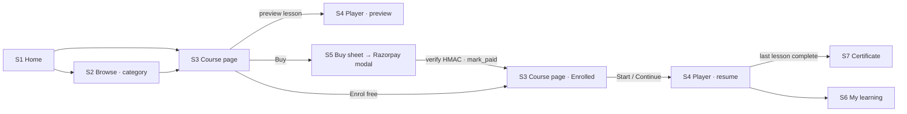
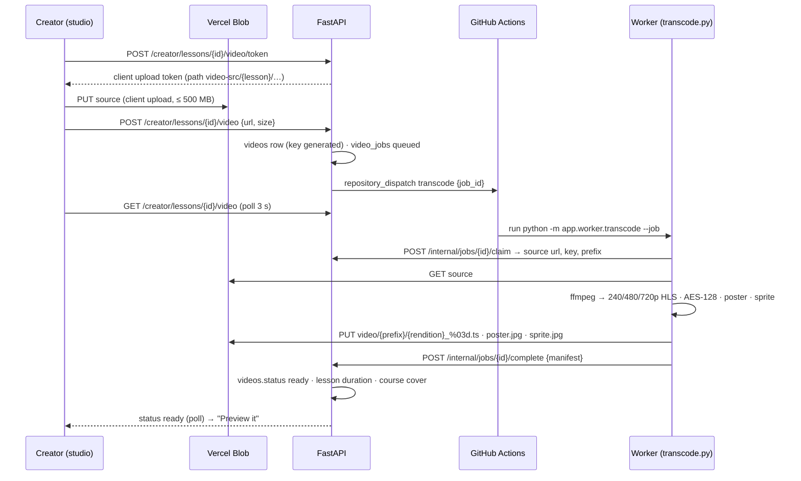
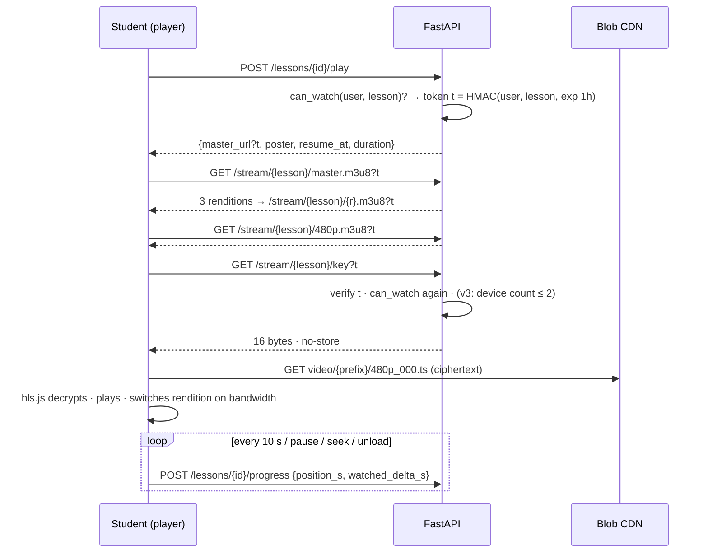
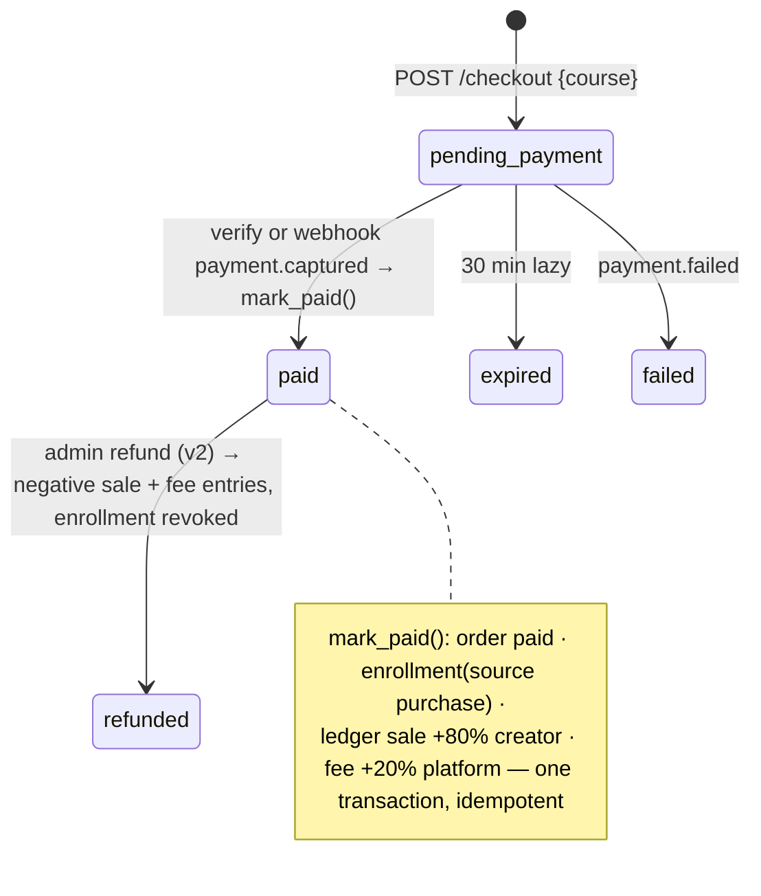
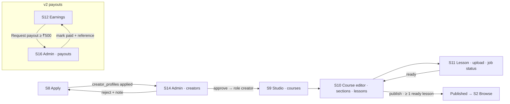
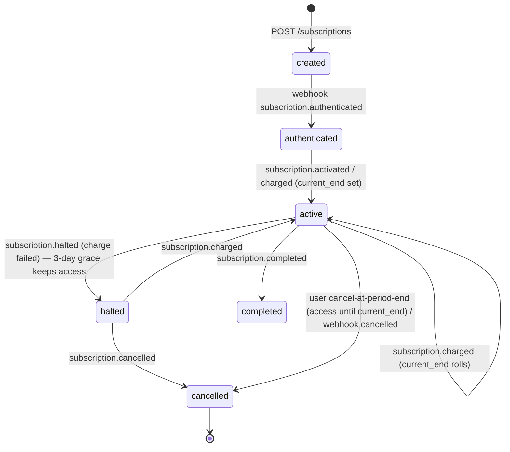
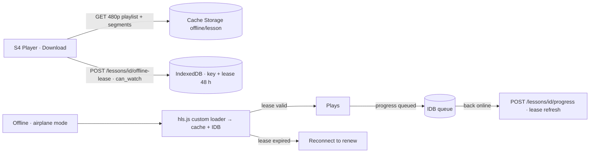

# Skillroom — User Flows & Screen Index

**Lifecycle step:** 3 of 17 · **Locked:** 2026-09-17 · Pairs with [03-requirements.md](03-requirements.md); every screen below gets a mockup in [04-ui-mockups.md](04-ui-mockups.md).

## Flow 1 — Browse to watching (v1, the main path)

## Flow 2 — Video: upload → worker → playable (v1, the hard part)

## Flow 3 — Playback and the key server (v1)

## Flow 4 — Video job state machine (v1)

```mermaid
stateDiagram-v2
  [*] --> queued: POST /creator/lessons/{id}/video
  queued --> processing: worker claim (attempts + 1)
  processing --> ready: complete {manifest}
  processing --> failed: fail {error} · or claim older than 20 min (stale)
  failed --> queued: admin / creator retry → re-dispatch
  ready --> queued: creator re-uploads (new prefix; old deleted when ready)
```

## Flow 5 — Buy → enrol → ledger (v1) and refund (v2)

## Flow 6 — Creator lifecycle (v1) and payouts (v2)

## Flow 7 — Subscription state machine (v2)

## Flow 8 — Offline lesson (v4)

## Screen index

| # | Screen | Route | Who | Version | Notes |
|---|---|---|---|---|---|
| S1 | Home | `/` | all | v1 · Continue watching in v2 | Exists as landing; becomes the catalogue home (hero, categories, new courses, free to start, creators) |
| S2 | Browse | `/courses`, `/courses?category=` | all | v1 · search in v3 | Course cards, category chips |
| S3 | Course page | `/c/[slug]` | all | v1 | Poster, curriculum with preview badges and ticks, creator card, Buy / Enrol free / Continue |
| S4 | Player | `/learn/[slug]/[lesson]` | student | v1 · captions + scrubbing in v2 · quiz link in v2 · Download in v4 | hls.js, sidebar curriculum, resources, **Resume** moment, mark complete |
| S5 | Buy sheet | `/c/[slug]` (sheet) → Razorpay modal → back | student | v1 | Price, what you get, Pay; dismissed state |
| S6 | My learning | `/me` | student | v1 · subscription card in v2 · downloads in v4 | Enrolled courses with progress, certificates, account |
| S7 | Certificate + Verify | `/certificates/[code]`, `/verify/[code]` | student / public | v1 | PDF view + download; public verify page |
| S8 | Sign in / up + Apply | `/sign-in`, `/sign-up`, `/apply` | all | v1 | Demo buttons (student, creator, admin); creator application form + status |
| S9 | Studio: courses | `/studio` | creator | v1 | Course list with status, lessons ready ⁄ total, enrollments, revenue |
| S10 | Studio: course editor | `/studio/courses/[id]` | creator | v1 · quiz editor in v2 · analytics tab in v3 | Details, sections → lessons with video state, publish checklist |
| S11 | Studio: lesson + video | `/studio/courses/[id]/lessons/[lid]` | creator | v1 · captions in v2 | Drop zone, upload bar, **job status (queued → processing → ready)**, poster, resources |
| S12 | Studio: earnings | `/studio/earnings` | creator | v1 (read) · payouts in v2 · pool math in v3 | Balance, entries, request payout |
| S13 | Admin: dashboard | `/admin` | admin | v1 | Revenue, enrollments, pending applications, failed jobs |
| S14 | Admin: creators | `/admin/creators` | admin | v1 | Applications approve / reject; creator list |
| S15 | Admin: courses + jobs | `/admin/courses`, `/admin/jobs` | admin | v1 | Takedown / restore; jobs by state with retry and error text |
| S16 | Admin: payouts | `/admin/payouts` | admin | v2 | Requested → paid (reference) / rejected |
| S17 | Quiz | `/learn/[slug]/quiz/[id]` | student | v2 | Questions, submit, score, retry |
| S18 | All-access | `/all-access` | all | v2 | ₹499 / month, subscribe, manage from `/me` |
| S19 | Creator page | `/u/[handle]` | all | v1 | Portrait, bio, area, published courses |
| S20 | States | various | all | v1 · offline in v4 | Not enrolled (preview only), video processing, video failed, takedown 404, expired lease / offline |
